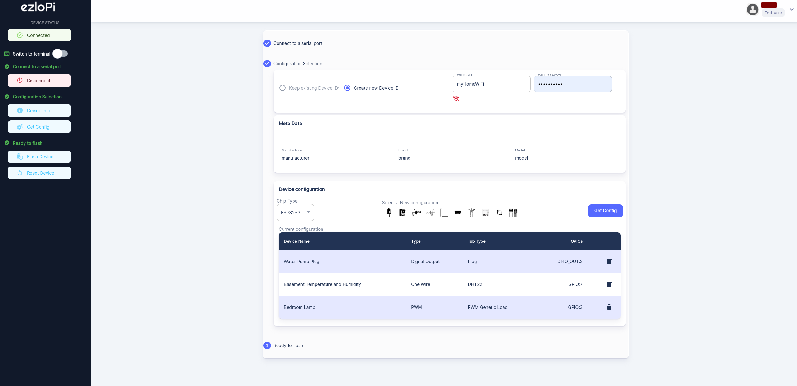

[](https://www.ezlopi.com/)

[](https://github.com/ezloteam/Ezlo_Pi/issues) [](https://github.com/ezloteam/Ezlo_Pi/network)

# ezlopi
EzloPi is a collaborative open-source project developed by Ezlo Innovation to enhance the functionalities of devices and platforms powered by the ESP32 chipset. It offers exceptional features that allow seamless configuration and control of ESP-based devices, empowering you to transform your automation concepts into reality.
Checkout our [website](https://www.ezlopi.com/) for further guide and examples

## supported features
* __GPIO__
* __Analog Input__
* __Digital Input__
* __PWM__
* __UART__
* __One Wire__
* __I2C__
* __SPI__
* __Other__

# 1. Getting started
EzloPi features a [web-based configurator](https://config.ezlopi.com/) that allows you to easily configure your ESP32 device for various supported features. The web interface provides a user-friendly platform to set up relays, analog inputs, digital inputs, and I2C-based sensors on your ESP32 device with ease. Once configured, you can leverage our cloud and mobile app services to remotely control your device in real-time.



# 2. Customizing and building EzloPi firmware in your local setup
It is required to have [ESP-IDF](https://github.com/espressif/esp-idf) installed in your machine.
Install ESP-IDF with taking help from the docs [here](https://docs.espressif.com/projects/esp-idf/en/v4.4.4/esp32/). ESP-IDF version [v4.4.4-292-g7894f032f6-dirty](https://github.com/espressif/esp-idf/releases/tag/v4.4.4).

### 1. Clone the Ezlo-Pi Repository from GitHub

Navigate to your terminal or bash shell and execute the following commands:

```bash
git clone --recursive git@github.com:ezloteam/Ezlo_Pi.git ezlopi
cd ezlopi/firmware/ezlopi
```

### 2. Build the Project

Execute the following command to build the project:

```bash
idf.py build
```

### 3. Flash the Firmware

To flash the firmware, use the following command:

```bash
idf.py -p <COM Port Name> -b <baud> flash
```

### 4. Open Serial Monitor

To open the serial monitor, use the following command:

```bash
idf.py -p <COM Port Name> monitor
```

Replace `<COM Port Name>` with the appropriate port name and `<baud>` with the desired baud rate.

# 3. Working with examples

[Follow from the examples](https://www.ezlopi.com/examples/)
1. [EzloPi AC Lamp setup with Relay interfacing​](https://www.ezlopi.com/examples/relay-circuitry-and-lamp-circuit-setup/)
2. [EzloPi AC lamp setup with relay and a momentary switch](https://www.ezlopi.com/examples/ezlopi-ac-lamp-setup-with-relay-and-a-momentary-switch/)
3. [EzloPi I2C MPU6050 Example](https://www.ezlopi.com/examples/ezlopi-i2c-mpu6050-example/)
4. [HCSR04 ultrasonic sensor example](https://www.ezlopi.com/examples/hcsr04-ultrasonic-sensor-example/)
5. [HRLV Maxsonar-EZ MB1013 sonar sensor example](https://www.ezlopi.com/examples/hrlv-maxsonar-ez-mb1013-sonar-sensor-uart-example/)
6. [LDR digital module example](https://www.ezlopi.com/examples/ldr-digital-module-example/)
7. [EzloPi Dimmable LED Example](https://www.ezlopi.com/examples/ezlopi-dimmable-led-example/)
8. [TTP223b touch sensor example](https://www.ezlopi.com/examples/ttp223b-touch-sensor-example/)
9. [Custom device/sensor integration guide](https://www.ezlopi.com/examples/ezlopi-v2-x-custom-device-sensorintegration-guide/)